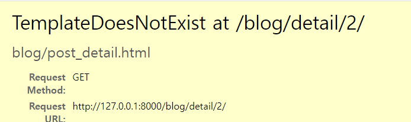
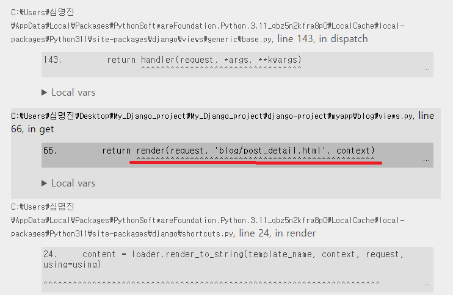
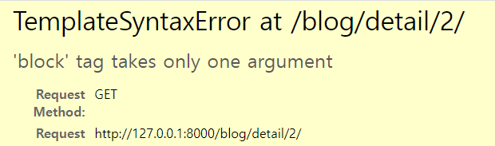
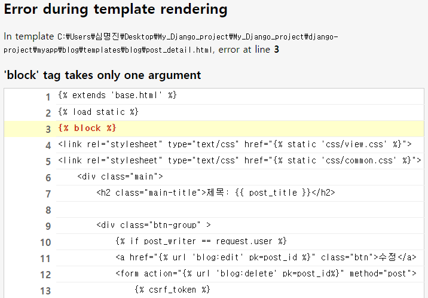

# 제목: Django Tutorial
* 부트스트랩을 이용한 기술 Blog 만들기
* 비전공자도 따라오기 쉬운 가이드버전


## 목표
* 단계별로 블로그 기능을 구현하되, 기능의 구현과 함께 에러를 직접 잡아보고 이해하도록 장고와 친해지는 것


## 목차
### 1. 폴더트리, 개발환경 및 개발기간
### 2. 단계별 요구사항
### 3. Error
### 4. 한계점
### 5. 느낀점


## 1. 폴더트리, 개발환경 및 개발기간
### 1-1 폴더트리
```
📦myapp
 ┣ 📂app
 ┃ ┣ 📂__pycache__
 ┃ ┃ ┣ 📜settings.cpython-311.pyc
 ┃ ┃ ┣ 📜urls.cpython-311.pyc
 ┃ ┃ ┣ 📜views.cpython-311.pyc
 ┃ ┃ ┣ 📜wsgi.cpython-311.pyc
 ┃ ┃ ┗ 📜__init__.cpython-311.pyc
 ┃ ┣ 📜asgi.py
 ┃ ┣ 📜settings.py
 ┃ ┣ 📜urls.py
 ┃ ┣ 📜views.py
 ┃ ┣ 📜wsgi.py
 ┃ ┗ 📜__init__.py
 ┣ 📂blog
 ┃ ┣ 📂migrations
 ┃ ┃ ┣ 📂__pycache__
 ┃ ┃ ┃ ┣ 📜0001_initial.cpython-311.pyc
 ┃ ┃ ┃ ┣ 📜0002_comment_post.cpython-311.pyc
 ┃ ┃ ┃ ┣ 📜0002_initial.cpython-311.pyc
 ┃ ┃ ┃ ┣ 📜0003_hashtag.cpython-311.pyc
 ┃ ┃ ┃ ┗ 📜__init__.cpython-311.pyc
 ┃ ┃ ┣ 📜0001_initial.py
 ┃ ┃ ┣ 📜0002_initial.py
 ┃ ┃ ┗ 📜__init__.py
 ┃ ┣ 📂static
 ┃ ┃ ┣ 📂asset
 ┃ ┃ ┃ ┗ 📂img
 ┃ ┃ ┃ ┃ ┣ 📜est.jpg
 ┃ ┃ ┃ ┃ ┣ 📜first.png
 ┃ ┃ ┃ ┃ ┣ 📜icon-search.png
 ┃ ┃ ┃ ┃ ┣ 📜icon-x.png
 ┃ ┃ ┃ ┃ ┣ 📜last.png
 ┃ ┃ ┃ ┃ ┣ 📜licat.png
 ┃ ┃ ┃ ┃ ┣ 📜next.png
 ┃ ┃ ┃ ┃ ┗ 📜prev.png
 ┃ ┃ ┣ 📂css
 ┃ ┃ ┃ ┣ 📜chat.css
 ┃ ┃ ┃ ┣ 📜common.css
 ┃ ┃ ┃ ┣ 📜list.css
 ┃ ┃ ┃ ┣ 📜login-join.css
 ┃ ┃ ┃ ┣ 📜table.css
 ┃ ┃ ┃ ┣ 📜view.css
 ┃ ┃ ┃ ┗ 📜write.css
 ┃ ┃ ┣ 📂js
 ┃ ┃ ┣ 📜chat.html
 ┃ ┃ ┣ 📜index.html
 ┃ ┃ ┣ 📜join.html
 ┃ ┃ ┣ 📜login.html
 ┃ ┃ ┣ 📜view.html
 ┃ ┃ ┗ 📜write.html
 ┃ ┣ 📂templates
 ┃ ┃ ┗ 📂blog
 ┃ ┃ ┃ ┣ 📜form_error.html
 ┃ ┃ ┃ ┣ 📜post_detail.html
 ┃ ┃ ┃ ┣ 📜post_edit.html
 ┃ ┃ ┃ ┣ 📜post_form.html
 ┃ ┃ ┃ ┗ 📜post_list.html
 ┃ ┣ 📂__pycache__
 ┃ ┃ ┣ 📜admin.cpython-311.pyc
 ┃ ┃ ┣ 📜apps.cpython-311.pyc
 ┃ ┃ ┣ 📜forms.cpython-311.pyc
 ┃ ┃ ┣ 📜models.cpython-311.pyc
 ┃ ┃ ┣ 📜urls.cpython-311.pyc
 ┃ ┃ ┣ 📜views.cpython-311.pyc
 ┃ ┃ ┗ 📜__init__.cpython-311.pyc
 ┃ ┣ 📜admin.py
 ┃ ┣ 📜apps.py
 ┃ ┣ 📜forms.py
 ┃ ┣ 📜models.py
 ┃ ┣ 📜tests.py
 ┃ ┣ 📜urls.py
 ┃ ┣ 📜views.py
 ┃ ┗ 📜__init__.py
 ┣ 📂locale
 ┃ ┗ 📂kr
 ┃ ┃ ┗ 📂LC_MESSAGES
 ┃ ┃ ┃ ┣ 📜django.mo
 ┃ ┃ ┃ ┗ 📜django.po
 ┣ 📂templates
 ┃ ┣ 📜base.html
 ┃ ┗ 📜index.html
 ┣ 📂user
 ┃ ┣ 📂migrations
 ┃ ┃ ┣ 📂__pycache__
 ┃ ┃ ┃ ┣ 📜0001_initial.cpython-311.pyc
 ┃ ┃ ┃ ┗ 📜__init__.cpython-311.pyc
 ┃ ┃ ┣ 📜0001_initial.py
 ┃ ┃ ┗ 📜__init__.py
 ┃ ┣ 📂templates
 ┃ ┃ ┗ 📂user
 ┃ ┃ ┃ ┣ 📜user_login.html
 ┃ ┃ ┃ ┗ 📜user_register.html
 ┃ ┣ 📂__pycache__
 ┃ ┃ ┣ 📜admin.cpython-311.pyc
 ┃ ┃ ┣ 📜apps.cpython-311.pyc
 ┃ ┃ ┣ 📜forms.cpython-311.pyc
 ┃ ┃ ┣ 📜models.cpython-311.pyc
 ┃ ┃ ┣ 📜urls.cpython-311.pyc
 ┃ ┃ ┣ 📜views.cpython-311.pyc
 ┃ ┃ ┗ 📜__init__.cpython-311.pyc
 ┃ ┣ 📜admin.py
 ┃ ┣ 📜apps.py
 ┃ ┣ 📜forms.py
 ┃ ┣ 📜models.py
 ┃ ┣ 📜tests.py
 ┃ ┣ 📜urls.py
 ┃ ┣ 📜views.py
 ┃ ┗ 📜__init__.py
 ┣ 📜db.sqlite3
 ┣ 📜manage.py
 ┗ 📜requirements.txt
```
### 1-2 개발환경
```

Django==4.2.2
django-bootstrap5==23.3
django-debug-toolbar==4.1.0
djangorestframework==3.14.0
executing==1.2.0
ipykernel==6.22.0
ipython==8.12.0
jedi==0.18.2
jupyter_client==8.2.0
jupyter_core==5.3.0
matplotlib-inline==0.1.6
nest-asyncio==1.5.6
packaging==23.1
parso==0.8.3
pickleshare==0.7.5
platformdirs==3.2.0
prompt-toolkit==3.0.38
psutil==5.9.5
pure-eval==0.2.2
Pygments==2.15.1
python-dateutil==2.8.2
pytz==2023.3
pywin32==306
pyzmq==25.0.2
six==1.16.0
sqlparse==0.4.4
stack-data==0.6.2
tornado==6.3.1
traitlets==5.9.0
tzdata==2023.3
wcwidth==0.2.6
```
### 1-3 개발기간
* 7/17 ~ 7/20

## 2. 단계별 요구 사항
### 0단계: Django Admin을 이용한 게시글 읽기 및 메인페이지 구현하기
* 게시글들과 게시글의 상세 페이지를 “보여주는”기능 완성
    * 메인페이지 구현   
    * 게시글 목록 기능 구현   
    * 게시글 상세보기 기능 구현   
### 1단계: 블로그 CRUD 기능 구현하기
* 게시글 작성 기능 구현
    * 로그인이 되지 않더라도 글 작성이    가능합니다. 인증은 다음단계에 있습니다.        
    * 게시글 제목과 내용을 작성 할 수 있는 페이지가 있어야합니다.           
    * 작성한 게시글이 저장되어 게시글 목록에 보여야 합니다.           
* 게시글 수정 기능 구현
    * 게시글의 제목 또는 내용을 수정 하는 기능            
    * 게시글 제목과 내용을 수정 할 수 있는 페이지가 있어야합니다.      
    * 수정된 내용은 게시글 목록보기/상세보기에 반영되어야합니다.      
* 게시글 삭제 기능 구현
    * 게시글을 삭제하는 기능           
    * 삭제를 완료한 이후에 게시글 목록 화면으로 돌아갑니다.           
```
    # 글 조회
    path("",views.Index.as_view(), name='list'), 
    # 글 상세조회
    path("detail/<int:pk>/", views.DetailView.as_view(), name='detail' ),
    #글 작성
    path("write/", views.Write.as_view(), name='write'),
    #글 수정
    path("detail/<int:pk>/edit/", views.Update.as_view(), name='edit'),
    #글 삭제
    path("detail/<int:pk>/delete/", views.Delete.as_view(), name='delete'),
```

### 2단계: 로그인/회원가입 기능을 이용하여 블로그 구현하기
* 메인페이지 구현
    * 회원가입/로그인 버튼이 있습니다.   
    * 회원가입 버튼을 클릭하면 회원가입 페이지로 이동   
    * 로그인 버튼을 클릭하면 로그인 페이지로 이동   
* 회원가입 기능 구현
    * 회원가입을 할 수 있는 페이지가 있어야합니다.              
* 로그인 기능 구현
    * 로그인을 할 수 있는 페이지가 있어야합니다.           
* 게시글 작성 기능 구현
    * 로그인을 한 유저만 해당 기능을 사용 할 수 있습니다.           
* 게시글 목록 기능 구현
    * 모든 사용자들이 게시한 블로그 게시글들의 제목을 확인 할 수 있습니다.          
* 게시글 수정 기능 구현
    * 로그인을 한 유저만 해당 기능을 사용 할 수 있습니다.          
    * 본인의 게시글이 아니라면 수정이 불가능합니다.          
* 게시글 삭제 기능 구현
    * 삭제된 게시글은 게시글 목록보기/상세보기에서 접근이 불가능하며,
    접근 시도 시 <존재하지 않는 게시글입니다> 라는 페이지를 보여줍니다.    


```
    # user/
    path('register/', views.Registration.as_view(), name='register'),
    # 로그인
    path('login/', views.Login.as_view(), name='login'),
    # 로그아웃
    path('logout/', views.Logout.as_view(), name='logout'),
```


## 3. Error
### !! 오타 확인 !!
* 디버깅을 시도 하려다 장고 자체만으로도 오류 잡기 편하도록 설명해 주고 있어 설명대로 따라하니 에러를 잡는데 문제가 없었다.

* makemirations: db가 충돌하는 경우가 많아서 db를 지우고 다시 실행하면 대부분 해결 가능했음
    * django.core.exceptions.잘못 구성됨: 'fields', name 등 에러명에 따라 속성값 한번더 확인       
    * url, view 작성 중간에 하면 에러가 나기떄문에 url을 손대기 전에 하던가, url-view-template 작성 후 진행

* TemplateDoseNotExist: 템플릿이 없거나, View에서 템플릿이 제대로 인식되지 않을 때 발생


    * 
        * 해결법: 템플릿의 이름과 view파일의 연결이 올바른지 확인    


    *     
        * 보통 View에 문제가 있는 경우가 많음     


* TemplateSyntaxError: 템플릿에 들어가야할 구문이 완성되지 않았거나, 인식되지 않을때 발생


    *       
        * 해결법: 화면에 나타나있는 에러설명을 따라 수정해주면 쉽게 해결가능          


    *         


* NoReverseMatch: url, template, view의 pk값이 제대로 전달되지 않을때 가장 많이 발생


    *          
        * 해결법: 화면에 나타나있는 에러설명을 따라 수정해주면 쉽게 해결가능          
        * 가장 많이 봤던 에러인데, 대부분 pk값이 맞지 않아서 생기는 문제였다. 템플릿과 view파일의 프라이머 키를 보는 것을 추천한다.            


* function() takes 0 positional arguments but 1 was given
    * view함수에 request 넣어주지 않았을때 발생           


* IndentationError: expected an indented block
    * 해결법: tab 으로 띄어쓰기가 잘못되었는지 확인을 해본다.            


* You are trying to add a non-nullable field '필드명' to post without a default
    * DB, 모델을 수정할 경우에 자주 발생           
    * 해결법: ```CharField(default = '')
    CharField(null = True)```
    default값과 null 을 허용해서 기존의 데이터들을 null 값이나 default 값으로 설정하는 방법이 있다.           
* * *
## 4. 한계점
기간이 짧은 것 같아서 무작정 코드부터 작성하기 시작하다보니 프로젝트의 방향을 잡기가 힘들었다. 특히 장고를 사용 할때 사용하기 편한 generic view로 작성하다 보니 CRUD까지는 편하게 사용이 가능했는데, 코멘트, 해쉬테그 부터 조금 막히더니 로그인 기능은 시도조차 하기 어려워서 다시 일반 클래스 뷰로 전체적으로 수정한다고 시간이 조금 많이 걸렸다. 

또한 2단계인 로그인, 회원가입 기능부터는 GPT와 강사님의 코드 없이는 혼자서 작성이 어려워서 거의 받아쓰기처럼 코드를 작성했다. 시간이 조금 여유로웠으면 혼자서 고민해봤을텐데 프로젝트 기간이 짧다보니 아쉬움이 많이 남았다.   

## 5. 느낀점
중간중간 부족한 자신 때문에 진도가 안나가서 심리적으로 조급해졌는데, 강사님이 하신 말씀이 떠올랐다. '두잘 전의 나와 비교해 보았을때 나는 성장 했는가?' 라고 스스로 물어본다면 확신있게 '그렇다' 라고 답할 수 있을 것 같다. 그렇게 생각하고 코드를 보니 error를 만나면 조금 즐거운 마음이 들었다. 아직 배울 것이 많고, error를 해결할때마다 쾌감이 느껴졌다.

장고는 사용할수록 매력있는 프레임워크인 것 같다. 코드를 이해함에 있어서 프로그래밍 언어중 파이썬을 이용한다는 것 부터가 초보자가 사용하기 좋은 것 같다.    